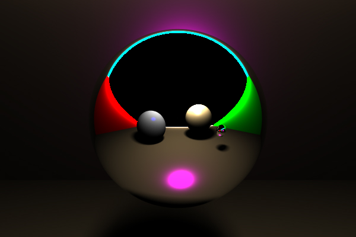

# Projet d'Informatique et Synthèse d'Images Réalistes

Développement d'un moteur de rendu par lancer de rayons (ray tracing). 

Rendu physiquement réaliste : implémentation du modèle de Cook-Torrance et de Oren-Nayar. 
Prise en charge de surfaces réfléchissantes (miroir).

## Résultat 

